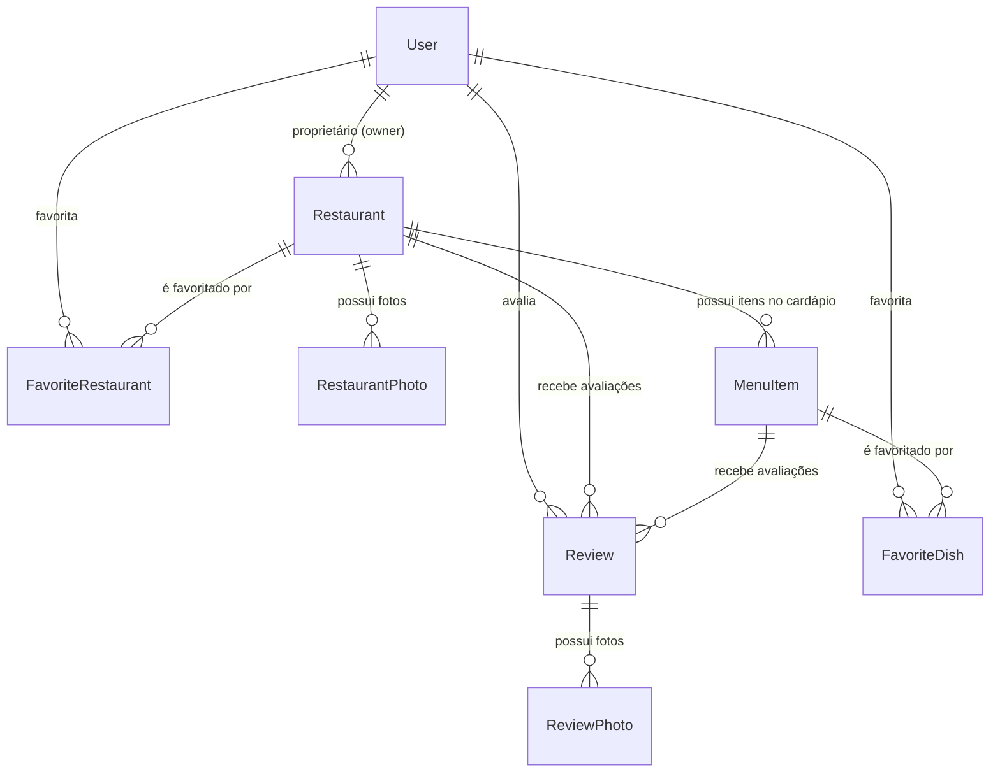

# Arquitetura do Sistema — Menu Digital

**Projeto:** Menu Digital — Cardápio Interativo & Descoberta Gastronômica  
**Instituição:** Centro Universitário de Brasília (CEUB) — Curso de ADS  
**Disciplina / Período:** Projeto Integrador II (2026/2) — Grupo 2  
**Repositório:** `CAMPUSCEUB/ADS20262Grupo2MenuDigital`  

---

## 1. Contexto Técnico e Visão Geral

O **Menu Digital** é uma plataforma distribuída voltada para a descoberta geoespacial de restaurantes, consulta de cardápios dinâmicos, roteamento viário e gestão de dados gastronômicos. A solução resolve a dor da fragmentação de informações (cardápios estáticos em PDF, falta de transparência em horários de funcionamento e ausência de consciência geoespacial em tempo real).

A engenharia do sistema foi estruturada sob o modelo de **Monorepo Contract-First**, garantindo que cliente móvel e servidor backend compartilhem rigorosamente as mesmas tipagens e regras de validação.

### Restrições e Padrões Operacionais
* **Ambiente Acadêmico & Custo Zero:** Uso de serviços gerenciados e APIs públicas abertas (Supabase Tier Gratuito, OpenStreetMap, OSRM) sem dependência de serviços proprietários pagos em moeda estrangeira.
* **Compatibilidade Multiplataforma:** Compilação nativa para Android e iOS com suporte a Web (navegadores desktop) a partir de uma base de código compartilhada em TypeScript.
* **TDD Estrito & Qualidade:** Pipeline de CI com validação unificada (`npm run verify`), somando **152 testes automatizados** cobrindo contratos, regras de negócio e integrações.

---

## 2. Componentes e Estrutura do Monorepo

O monorepo é gerenciado via **npm workspaces** e composto por três pacotes desacoplados:

```mermaid
flowchart TD
    subgraph Client["apps/mobile (Expo SDK 57 / React Native 0.86)"]
        Router["Expo Router v6 (File-Based Routing)"]
        UIComponents["Design System & Telas (Home, Buscar, Mapa, Cardápio, Detalhes, Perfil)"]
        ClientContexts["Contextos de Estado (AuthContext, FavoritesContext)"]
        MapEngine["Motor de Mapas Híbrido (InteractiveMap + Supercluster + OSM)"]
        ClientServices["Serviços HTTP (api.ts, osrm.ts, upload)"]
        Router --> UIComponents
        UIComponents --> ClientContexts
        UIComponents --> MapEngine
        ClientContexts --> ClientServices
    end

    subgraph Contracts["packages/contracts (Single Source of Truth)"]
        ZodSchemas["Schemas Zod (Auth, Restaurant, Menu, Route, Upload, Review, Favorite)"]
        StaticTypes["Tipos Estáticos TypeScript Inferidos (z.infer<T>)"]
        ZodSchemas --> StaticTypes
    end

    subgraph Server["apps/api (Express 5 & TypeScript)"]
        Middlewares["Middlewares (authMiddleware, validateRequest, assertOwner)"]
        Controllers["Controllers (Auth, Restaurant, Menu, Route, Upload, Review, Favorite)"]
        Services["Services (Business Logic, Geospatial, Compensatory Tx, Haversine Fallback)"]
        DataAccess["Data Access Layer (Prisma ORM 6.19)"]
        Middlewares --> Controllers
        Controllers --> Services
        Services --> DataAccess
    end

    subgraph Infrastructure["Serviços Externos & Nuvem"]
        PostgresDB[("PostgreSQL 15+ (Supabase Database)")]
        SupabaseAuthCloud["Supabase Auth (JWT Management)"]
        SupabaseStorageCloud["Supabase Storage (Object Storage Bucket)"]
        OSRMCloud["OSRM Routing Machine (Public Service)"]
    end

    Contracts ==>|Tipos e Validações de UI| Client
    Contracts ==>|Validação Estrita de Payloads| Server
    ClientServices -.->|HTTP / REST JSON| Middlewares
    DataAccess -->|TCP / Prisma Client| PostgresDB
    Services -->|Admin SDK (Transação Compensatória)| SupabaseAuthCloud
    Services -->|Geração de Presigned URLs| SupabaseStorageCloud
    ClientServices -.->|Upload Direto de Binários PUT| SupabaseStorageCloud
    Services -->|Requisição Viária (Timeout 8s)| OSRMCloud
```

### 2.1 `packages/contracts` (Núcleo de Tipagem)
Centraliza todos os schemas de validação usando **Zod**. Qualquer alteração de contrato reflete instantaneamente em tempo de compilação tanto na API quanto no Mobile, garantindo a imunidade contra falhas de desserialização em runtime.

### 2.2 `apps/api` (Backend RESTful)
Construído com **Express 5** e **TypeScript** estruturado no padrão Clean Layered Architecture:
* **Middlewares:** Interceptam e validam payloads com Zod (`validateRequest`), autenticam JWTs via Supabase (`authMiddleware`) e verificam posse de recursos (`assertOwner`).
* **Controllers:** Tratam protocolo HTTP e status codes (200, 201, 204, 400, 401, 403, 404, 500).
* **Services:** Concentram a lógica de negócio pura, orquestração de transações compensatórias, cálculos geoespaciais e fallbacks de rede.
* **Data Access (Prisma Client):** Mapeamento objeto-relacional tipado comunicando com PostgreSQL.

### 2.3 `apps/mobile` (Aplicativo Móvel)
Desenvolvido com **Expo SDK 57**, **React Native 0.86.3** e **React 19.2.3**:
* **Expo Router v6:** Roteamento baseado em sistema de arquivos com tipagem estrita de parâmetros (`app/restaurante/[id].tsx`, `app/restaurante/[id]/cardapio.tsx`).
* **Ergonomia & Safe Area:** Provedor raiz `<SafeAreaProvider>` eliminando quebras em Dynamic Island e Notches; formulários encapsulados com `<KeyboardAvoidingView>` e `<ScrollView keyboardShouldPersistTaps="handled">`.
* **Acessibilidade Assistiva:** Conformidade WCAG 2.5.8 com áreas de toque expandidas via `hitSlop` (44x44pt) e supressão auditiva em ícones decorativos para TalkBack e VoiceOver.
* **Motor de Mapas:** Componente `InteractiveMap` com `react-native-maps` e clusterização espacial via `supercluster` (árvore K-D).

---

## 3. Integrações Externas

| Integração | Finalidade Técnica | Padrão / Estratégia Adotada | Risco Mapeado | Mitigação de Engenharia |
|---|---|---|---|---|
| **Supabase Auth** | Autenticação, emissão de JWTs e recuperação de senha. | Autenticação Híbrida: Supabase gerencia credenciais e Prisma armazena entidade `User`. | *Dual-Write Problem*: falha no banco local deixando usuário órfão no Auth. | Transação Compensatória imediata com `supabaseAdmin.deleteUser(id)` em caso de falha de persistência ([ADR 0001](adr/0001-autenticacao-hibrida-supabase-prisma.md)). |
| **Supabase Storage** | Armazenamento de fotos de restaurantes, cardápios e avaliações. | **Presigned URLs**: cliente requisita URL pré-assinada à API e faz upload binário direto (`PUT`) ao bucket. | Sobrecarga de memória e CPU na API Express com binários pesados de imagens. | O backend manipula apenas metadados JSON; o tráfego de mídia é transferido diretamente para a CDN do Supabase ([ADR 0013](adr/0013-pipeline-upload-imagens-presigned-urls-supabase.md)). |
| **OSRM (Routing)** | Cálculo de traçado viário, distância e tempo estimado (carro e a pé). | Requisição HTTP para API pública com User-Agent institucional registrado. | Latência externa, indisponibilidade ou rate limit no servidor comunitário. | Timeout estrito de 8 segundos com **Fallback Gracioso para Haversine** e estimativa por velocidade regulamentada ([ADR 0010](adr/0010-calculo-rota-tempo-estimado-osrm.md)). |
| **OpenStreetMap & OSMDroid** | Renderização de mapa e tiles sem custo de licenciamento. | Tiles OSM via `UrlTile` e `react-native-maps-osmdroid` no Android. | Exigência de API key do Google Maps no Android gerando watermark "API key required". | Desacoplamento nativo do SDK do Google Maps no Android em favor do motor OSMDroid nativo ([ADR 0004](adr/0004-arquitetura-mapas-geolocalizacao-hibrida.md)). |

---

## 4. Arquitetura de Dados e Persistência

O modelo relacional é suportado pelo **PostgreSQL** via migrações declarativas do **Prisma ORM**:



### Regras de Integridade e Otimização
* **Agrupamento de Cardápio Otimizado:** Índice composto `@@index([restaurantId, category])` no modelo `MenuItem` para recuperação paginada instantânea.
* **Unicidade de Interações:** `@@unique([userId, restaurantId])` em `Review` e `FavoriteRestaurant` impedindo duplicações concorrentes.
* **Políticas de Exclusão Segura:**
  * Exclusão em cascata (`onDelete: Cascade`) em pratos, fotos e avaliações atrelados a um restaurante removido.
  * Preservação de entidade (`onDelete: SetNull`) na relação `Restaurant.ownerId -> User`, garantindo que o encerramento de uma conta de usuário não destrua a pessoa jurídica do restaurante.

---

## 5. Decisões Arquiteturais Registradas (ADRs)

Todas as grandes decisões técnicas do projeto são documentadas formalmente em [docs/adr/](adr/):

| ADR | Título / Decisão | Status |
|---|---|---|
| **[ADR 0001](adr/0001-autenticacao-hibrida-supabase-prisma.md)** | Autenticação Híbrida Supabase Auth e Prisma ORM com Transação Compensatória | Aceito |
| **[ADR 0002](adr/0002-expo-router-v6-e-reanimated.md)** | Roteamento Baseado em Arquivos com Expo Router v6 e Animações Reanimated | Aceito |
| **[ADR 0003](adr/0003-contratos-compartilhados-zod-monorepo.md)** | Desenvolvimento Contract-First com Zod em Monorepo Compartilhado | Aceito |
| **[ADR 0004](adr/0004-arquitetura-mapas-geolocalizacao-hibrida.md)** | Arquitetura de Mapas, Geolocalização Híbrida e Agrupamento Espacial | Aceito |
| **[ADR 0005](adr/0005-ampliacao-perfil-restaurante.md)** | Ampliação do Perfil do Restaurante (CNPJ, Galeria 1:N, Horários e Pagamentos) | Aceito |
| **[ADR 0006](adr/0006-listagem-paginada-restaurantes-home.md)** | Listagem Paginada de Restaurantes na Home com Skeletons | Aceito |
| **[ADR 0007](adr/0007-busca-textual-filtros-restaurantes.md)** | Busca Textual Insensível a Acentos (Unaccent) e Debounce no Mobile | Aceito |
| **[ADR 0008](adr/0008-filtros-avancados-preco-avaliacao-distancia-horario.md)** | Filtros Avançados de Preço, Avaliação, Distância e Status Aberto Agora | Aceito |
| **[ADR 0009](adr/0009-ordenacao-resultados-restaurantes.md)** | Ordenação Multicritério de Restaurantes no Backend e Persistência no App | Aceito |
| **[ADR 0010](adr/0010-calculo-rota-tempo-estimado-osrm.md)** | Cálculo de Rota e Tempo Estimado via OSRM com Fallback Gracioso Haversine | Aceito |
| **[ADR 0011](adr/0011-tela-detalhes-restaurante-hu10.md)** | Tela de Detalhes do Restaurante, Horários com Destaque e Ações Nativas | Aceito |
| **[ADR 0012](adr/0012-cardapio-digital-categorias-hu11.md)** | Cardápio Digital por Categorias, Abas Sticky e Gestão de Pratos com Posse | Aceito |
| **[ADR 0013](adr/0013-pipeline-upload-imagens-presigned-urls-supabase.md)** | Pipeline de Upload de Imagens com Presigned URLs no Supabase Storage | Aceito |
| **[ADR 0014](adr/0014-refinamento-ui-ux-acessibilidade-arquitetura-telas.md)** | Refinamento Estrutural de UI/UX, Acessibilidade Assistiva e Separação de Telas | Aceito |

---

## 6. Riscos Técnicos e Matriz de Mitigação

| Risco | Impacto | Probabilidade | Mitigação Arquitetural |
|---|---|---|---|
| **Rate Limit / Queda da API do OSRM** | Médio | Média | Fallback imediato para Haversine com duração estimada e aviso não-bloqueante ao usuário. |
| **Inconsistência de Auth (Dual-Write)** | Alto | Baixa | Transação compensatória no backend que deleta a credencial Supabase caso o banco falhe. |
| **Vazamento de Chaves Privadas** | Crítico | Baixa | Service Role Key restrita ao backend Express; mobile consome apenas chave pública de anon. |
| **Degradação de FPS por Excesso de Marcadores** | Médio | Alta | Clusterização dinâmica em árvore K-D com `supercluster` mantendo 60 FPS no mapa. |
| **Oclusão de Teclado em Formulários Móveis** | Alto | Alta | Adoção de `KeyboardAvoidingView` e `ScrollView keyboardShouldPersistTaps="handled"` em todas as telas de autenticação. |
| **Gargalo de CPU em Uploads de Fotos** | Médio | Média | Upload direto via Presigned URLs, transferindo tráfego para a infraestrutura de Object Storage. |

---

## 7. Relação com a Governança e Agentes de IA

Para detalhes sobre a governança técnica, convenções de código, pipeline de CI e agentes de IA que mantêm e auditam esta arquitetura, consulte o **[Guia de Desenvolvimento com IA](desenvolvimento-com-ia.md)** e as diretrizes em **[AGENTS.md](../AGENTS.md)**.
