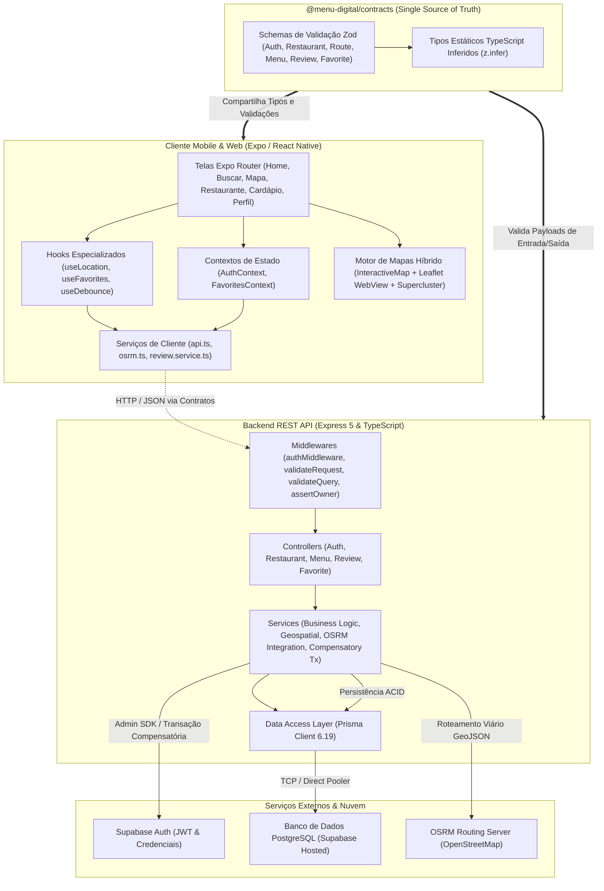

# Relatório Técnico e Arquitetural Executivo — Menu Digital
**Documento de Engenharia de Software | Nível Senior / Staff Engineer**  
**Projeto:** Menu Digital — Cardápio Interativo & Descoberta Gastronômica  
**Instituição:** Centro Universitário de Brasília (CEUB) — Curso de ADS  
**Disciplina / Período:** Projeto Integrador II (2026/2) — Grupo 2  
**Identificador do Repositório:** `CAMPUSCEUB/ADS20262Grupo2MenuDigital`  
**Data da Emissão:** 23 de Setembro de 2026  
**Status do Projeto:** Sprints 01 a 04 Concluídas | Sprint 05 em Andamento | 152 Testes Automatizados (100% Passando)

---

## 1. Sumário Executivo e Visão Geral

### 1.1 Contexto e Justificativa de Negócio
No ecossistema gastronômico atual, consumidores e gestores de restaurantes enfrentam gargalos críticos decorrentes da fragmentação de informações:
* **Dependência de Cardápios Estáticos:** O consumo de cardápios via fotos de baixa resolução ou arquivos PDF compartilhados em redes sociais resulta em frequente desatualização de preços, falta de aviso de itens esgotados e atrito na escolha do cliente.
* **Ausência de Consciência Geoespacial em Tempo Real:** Usuários frequentemente não sabem quais estabelecimentos estão efetivamente abertos no momento de sua busca, a distância real em malha viária ou o tempo estimado de deslocamento (a pé ou de carro).
* **Falta de Transparência sobre Restrições e Avaliações:** Ausência de centralização de notas de pratos individuais, fotos reais e respostas de estabelecimentos a clientes.
* **Sobrecarga Operacional dos Restaurantes:** Atualizações manuais em plataformas desconexas geram retrabalho e inconsistências no atendimento diário.

O **Menu Digital** foi concebido e implementado para solucionar essa dor por meio de uma plataforma unificada de alta disponibilidade, arquitetada sob o modelo de **Monorepo Contract-First**, combinando aplicação móvel nativa/web com backend RESTful resiliente e geoprocessamento em tempo real.

### 1.2 Métricas de Qualidade e Governança do Projeto
* **Arquitetura de Código:** Monorepo gerenciado via npm workspaces com separação estrita de responsabilidades (`apps/api`, `apps/mobile`, `packages/contracts`).
* **Qualidade de Testes:** **152 testes automatizados** distribuídos em **56 suítes** no backend e contratos, executando em tempo recorde (~3.1 segundos) com 100% de sucesso (`pass: 152, fail: 0`).
* **Decisões Documentadas:** **14 Architecture Decision Records (ADRs)** formais aprovadas e versionadas no repositório.
* **Governança de Agentes:** Toolchain proprietária de IA integrada aos padrões abertos da indústria (`obra/superpowers`, `mattpocock/skills` e `affaan-m/ECC`), operando sob ciclo TDD estrito e auditoria contínua de segurança.

---

## 2. Stack Tecnológica e Racional de Engenharia

A escolha de cada tecnologia do projeto foi pautada por critérios de produtividade, tipagem estática ponta a ponta, desempenho em tempo de execução, custo zero de infraestrutura acadêmica e aderência aos padrões modernos da indústria.

| Camada / Componente | Tecnologia Adotada | Versão | Racional de Engenharia e Trade-offs |
|---|---|---|---|
| **Estratégia de Repositório** | **npm Workspaces (Monorepo)** | Node `>= 22.0.0` / npm `>= 10.0.0` | Centraliza backend, mobile e contratos em um único repositório git. Garante sincronia atômica de versões entre cliente e servidor, compartilhamento direto de tipos TypeScript e pipeline unificada de CI/CD local (`npm run verify`). |
| **Linguagem Principal** | **TypeScript** | `~5.9.2` (API/Contracts) / `~6.0.3` (Mobile) | Tipagem estática rigorosa (`strict: true`), eliminando erros de runtime em produção e viabilizando autocompletion e refatorações automatizadas seguras em todo o código. |
| **Aplicação Mobile** | **React Native + Expo SDK** | React Native `0.86.3` / Expo SDK `~57.0.23` / React `19.2.3` | Permite compilação nativa para Android, iOS e Web a partir de um único código-fonte TypeScript. O ecossistema Expo 57 garante acesso otimizado a APIs nativas do hardware (GPS, câmera, haptics e armazenamento seguro). |
| **Roteamento Mobile** | **Expo Router v6** | `~57.0.21` | Roteamento baseado em arquivos (*file-based routing*), unificando stacks nativas e tab bars com tipagem profunda de parâmetros de rota (ex: `app/restaurante/[id].tsx`). Evita boilerplate de configuração de navegação. |
| **Componentes e Animações** | **Reanimated & Safe Area Context** | Reanimated `4.5.1` / Safe Area `~5.7.0` | Execução de animações na thread de UI nativa a 60/120 FPS sem engasgos na thread JavaScript do React, com suporte a telas modernas com notch/Dynamic Island. |
| **Camada de Mapas & Cluster** | **react-native-maps + Leaflet/OSM + Supercluster** | `react-native-maps 1.27.2` / `supercluster 9.0.0` | Arquitetura híbrida: `react-native-maps` nativo com fallback para Leaflet/OpenStreetMap via WebView. Supercluster indexa coordenadas em árvore K-D para agrupar marcadores em tempo real sem sobrecarregar a memória do aparelho. |
| **Manipulação de Imagens** | **expo-image + expo-image-picker** | `expo-image ~57.0.5` / `picker ^57.0.18` | Renderização de fotos com cache agressivo em memória/disco, decodificação em segundo plano e transições suaves. O image picker possibilita captura via câmera física ou galeria do dispositivo. |
| **Backend REST API** | **Express 5** | `^5.2.1` | A nova geração do Express oferece suporte nativo e robusto a rotas assíncronas (`async/await`) sem necessidade de middlewares de encapsulamento como `express-async-errors`, simplificando o tratamento de exceções. |
| **Mapeamento Objeto-Relacional** | **Prisma ORM** | `^6.19.1` | Gera automaticamente um cliente TypeScript type-safe a partir do schema relacional, gerenciando migrações versionadas (`prisma migrate`), integridade referencial e consultas complexas com relações. |
| **Banco de Dados Relacional** | **PostgreSQL (Supabase Postgres)** | Engine 15+ | Banco de dados ACID relacional de alta confiabilidade com suporte nativo a tipos UUID, índices compostos e busca geoespacial/textual. |
| **Autenticação & Sessões** | **Supabase Auth** | `@supabase/supabase-js ^2.112.4` | Serviço corporativo de autenticação gerenciado, responsável por criptografia de senhas, emissão e validação de tokens JWT (HS256/RS256) e fluxo de recuperação de senhas por e-mail. |
| **Validação e Contratos** | **Zod** | `^3.24.2` | Single Source of Truth em `packages/contracts`. Schemas declarativos que validam dados de entrada e saída na API e inferem automaticamente os tipos estáticos utilizados pelo app móvel. |
| **Serviço de Roteamento Viário** | **OSRM (Open Source Routing Machine)** | Public API (`router.project-osrm.org`) | Cálculo de distâncias viárias e tempos estimados para automóvel (`driving`) e pedestre (`walking`) sem necessidade de chaves pagas em dólar, com cabeçalho institucional customizado e resiliência via fallback Haversine. |
| **Execução de Testes e CI** | **Node.js Test Runner + tsx** | Node `>= 22` / tsx `^4.19.3` | Testes automatizados executados diretamente sobre código TypeScript sem etapa intermediária de compilação lenta, reduzindo o tempo de CI e eliminando dependências pesadas de frameworks externos de teste. |

---

## 3. Arquitetura de Software e Padrões Estruturais

A arquitetura do Menu Digital foi estruturada segundo os princípios de **Clean Architecture**, **Layered Architecture (Arquitetura em Camadas)** e **Contract-First Design**.



### 3.1 Padrão em Camadas no Backend (Layered Architecture)
O backend (`apps/api`) desacopla rigorosamente protocolo HTTP de regras de negócio:
1. **Middlewares:** Executam antes do controlador. O middleware `validateRequest` e `validateQuery` intercepta a requisição e valida o payload contra o schema Zod do `@menu-digital/contracts`. Se houver inconformidade, rejeita com HTTP 400 antes de tocar na lógica interna. O `authMiddleware` valida o JWT do Supabase e anexa o usuário em `req.user`. O middleware `assertOwner` verifica a posse do recurso.
2. **Controllers:** Responsáveis estritamente pela tradução do protocolo HTTP: extração de parâmetros de rota (`params`), query strings (`query`) e corpo (`body`), invocação do serviço correspondente e despacho do código HTTP adequado (200, 201, 204, 400, 403, 404).
3. **Services:** Centralizam as regras de negócio puras, cálculos matemáticos (Haversine), chamadas a serviços terceiros (OSRM) e transações compensatórias. Não possuem acoplamento com objetos `req` ou `res` do Express, permitindo testabilidade unitária isolada.
4. **Data Access (Prisma Client):** Camada de abstração que dialoga diretamente com o PostgreSQL através de modelos fortemente tipados e transações ACID.

---

## 4. Engenharia Defensiva e Padrões de Resiliência

Como padrão sênior, sistemas distribuídos devem ser projetados para falhas. O projeto Menu Digital implementa quatro padrões essenciais de resiliência:

### 4.1 Prevenção do Dual-Write Problem via Transação Compensatória (ADR 0001)
Ao adotar uma arquitetura híbrida com **Supabase Auth** (gestão de credenciais) e **Prisma ORM / PostgreSQL** (dados de domínio), surge o clássico problema de escrita dupla (*Dual-Write*): se a escrita no banco local falhar após a criação no serviço de autenticação, o e-mail do usuário fica órfão e travado no Auth, impedindo novos cadastros.

**Solução Implementada:**
```
[Cliente] POST /auth/register
   │
   ├──> 1. supabase.auth.signUp()  ───> Sucesso: Retorna ID UUID
   │
   ├──> 2. prisma.user.create()
   │        │
   │        ├── [Sucesso] ──> Responde HTTP 201 (Usuário registrado com sucesso)
   │        │
   │        └── [FALHA] (Timeout / Constraint Violation / Queda de BD)
   │                 │
   │                 └──> TRANSAÇÃO COMPENSATÓRIA IMEDIATA:
   │                      supabaseAdmin.auth.admin.deleteUser(id)
   │                      ├── Exclui o usuário órfão do Auth usando Service Role Key
   │                      └── Responde HTTP 500 informando falha de persistência
```
*Isolamento de Segurança:* A `SUPABASE_SERVICE_ROLE_KEY` permanece **estritamente restrita ao backend**, nunca sendo exposta ao bundle do aplicativo móvel.

### 4.2 Roteamento Viário com Fallback Gracioso (ADR 0010)
A rota entre o usuário e o restaurante é calculada consumindo a API pública do OSRM. Como o servidor comunitário pode sofrer rate-limits ou picos de latência:
1. A requisição HTTP backend ao OSRM possui um timeout estrito de **8 segundos** e cabeçalho `User-Agent` institucional registrado.
2. Na hipótese de status 429, 500, timeout ou erro de rede, o serviço **não estoura HTTP 500 no app**.
3. O `RouteService` aciona um **Fallback Gracioso para a Fórmula de Haversine** (distância esférica em linha reta), estimando a duração com base em velocidades médias regulamentadas (30 km/h para condução automotiva e 5 km/h para caminhada a pé).
4. O payload de resposta sinaliza `isFallback: true` e a mensagem de contingência, mantendo a experiência do usuário 100% operacional.

### 4.3 Arquitetura de Mapas Híbrida e Agrupamento Espacial (ADR 0004)
1. **Multiplataforma Nativo/Web:** A biblioteca nativa `react-native-maps` quebra ao ser empacotada para navegadores desktop. A solução emprega extensão `.web.tsx` e integração de Leaflet/OpenStreetMap via WebView, viabilizando execução simultânea em emuladores móveis e navegadores web.
2. **Agrupamento com Supercluster:** Para evitar travamento de renderização e engasgos em regiões com alta concentração de restaurantes, o app utiliza a biblioteca `supercluster` (baseada em árvore K-D espacial). Marcadores próximos são aglutinados em nós de contagem numérica que se expandem fluidamente ao zoom.

### 4.4 Resolução Dinâmica de Host para Ambientes de Rede Local
Para permitir testes reais em dispositivos físicos (Android/iOS via Expo Go) sem forçar o desenvolvedor a alterar manualmente variáveis de ambiente `.env` toda vez que muda de rede Wi-Fi, o serviço `api.ts` inspeciona dinamicamente `Constants.expoConfig?.hostUri`. Caso detecte conexão de aparelho físico com o Metro Bundler, roteia as chamadas para a porta 3333 do IP LAN da máquina de desenvolvimento automaticamente.

### 4.5 Pipeline de Upload de Imagens com Presigned URLs (ADR 0013)
O tráfego de mídia pesada representa um dos principais riscos de degradação em backends Node.js baseados em event loop. Para prevenir estouro de memória e concorrência com requisições transacionais:
1. O backend Express **não processa binários multipart/form-data**.
2. A rota autenticada `POST /upload/presigned-url` valida o tamanho (até 10MB) e formato (`jpeg`, `png`, `webp`) via Zod, delegando ao `supabaseAdmin` a geração de uma URL de upload pré-assinada temporária com expiração segura.
3. O cliente móvel executa um `PUT` binário direto via `useImagePicker` contra o bucket do Supabase Storage.
4. Somente a URL pública definitiva com CDN é associada às entidades do banco relacional, garantindo escalabilidade ilimitada a custo zero de computação no servidor.

### 4.6 Desacoplamento Nativo de Mapas no Android sem Google SDK (Issue #47)
Para contornar a exigência estrutural de API keys do Google Maps no Android (que gerava o erro visual repetido "API key required" sobreposto às tiles do OpenStreetMap):
1. A infraestrutura Android migrou para o driver nativo `react-native-maps-osmdroid`, que consome OSMDroid nativamente em Java/Kotlin sem invocar bibliotecas do Google Play Services.
2. No iOS, mantém-se o `PROVIDER_DEFAULT` (Apple Maps nativo via MapKit), livre de qualquer exigência de credencial proprietária.
3. Isso preserva a experiência limpa de visualização cartográfica 100% gratuita e em conformidade estrita com o ambiente acadêmico.

### 4.7 Ergonomia Móvel, Acessibilidade Assistiva e Safe Area (ADR 0014)
1. **Governança de Safe Area:** A raiz da aplicação foi unificada com `<SafeAreaProvider>`, eliminando margens fixas de 20px e garantindo adaptação natural a telas modernas com entalhes de câmera e Dynamic Island.
2. **Formulários Resilientes ao Teclado:** Os fluxos de autenticação combinam `<KeyboardAvoidingView>` com `<ScrollView keyboardShouldPersistTaps="handled">`, permitindo dispensa do teclado com um toque e clique imediato de submissão sem double-tap.
3. **Acessibilidade e Métricas HIG / WCAG:** Adoção de áreas mínimas de toque de 44x44pt (`hitSlop`), contraste de cor de alto padrão (WCAG AAA 7:1 com dourado institucional `#E5A93C`) e supressão auditiva declarativa de ícones decorativos (`accessible={false}`, `aria-hidden={true}`) para navegação limpa no TalkBack e VoiceOver.

---

## 5. Modelagem de Dados Relacional (PostgreSQL / Prisma)

O banco de dados relacional foi modelado para suportar todas as regras de negócio com integridade referencial estrita, índices de alta performance e suporte a exclusão em cascata.

```mermaid
erDiagram
    User ||--o{ Restaurant : "proprietário (owner)"
    User ||--o{ Review : "avalia"
    User ||--o{ FavoriteRestaurant : "favorita"
    User ||--o{ FavoriteDish : "favorita"

    Restaurant ||--o{ RestaurantPhoto : "possui fotos"
    Restaurant ||--o{ MenuItem : "possui itens no cardápio"
    Restaurant ||--o{ Review : "recebe avaliações"
    Restaurant ||--o{ FavoriteRestaurant : "é favoritado por"

    MenuItem ||--o{ Review : "recebe avaliações"
    MenuItem ||--o{ FavoriteDish : "é favoritado por"

    Review ||--o{ ReviewPhoto : "possui fotos"

    User {
        uuid id PK "Chave herdada do Supabase Auth"
        string email UK "E-mail único"
        string role "user | restaurant | admin"
        timestamptz created_at
        timestamptz updated_at
    }

    Restaurant {
        uuid id PK
        string name "Nome fantasia"
        string address "Endereço completo"
        string cuisine_type "Tipo de culinária"
        string image_url "Foto de capa"
        float latitude "Coordenada geodésica"
        float longitude "Coordenada geodésica"
        uuid owner_id FK "Vínculo com User (SetNull)"
        string phone "Telefone / WhatsApp"
        string cnpj UK "CNPJ validado"
        text description "Descrição do restaurante"
        enum price_range "$, $$, $$$"
        float rating "Média de avaliações"
        json business_hours "Horários por dia e múltiplos turnos"
        enum_array payment_methods "PIX, Cartões, Dinheiro, etc."
        json social_links "Links sociais"
        string street
        string number
        string complement
        string neighborhood
        string city
        string state "UF (2 letras)"
        string postal_code "CEP"
        timestamptz created_at
        timestamptz updated_at
    }

    RestaurantPhoto {
        uuid id PK
        uuid restaurant_id FK "Cascade Delete"
        string url "URI da imagem"
        int order "Ordem de exibição"
        timestamptz created_at
    }

    MenuItem {
        uuid id PK
        uuid restaurant_id FK "Cascade Delete"
        string category "Categoria temática (Entradas, Bebidas, etc.)"
        string name "Nome do prato"
        text description "Ingredientes e detalhes"
        decimal price "Preço unitário (Decimal 10,2)"
        string photo_url "Foto do prato"
        boolean available "Disponibilidade imediata (true/false)"
        float rating "Média de notas do prato"
        int reviews_count "Quantidade de avaliações"
        timestamptz created_at
        timestamptz updated_at
    }

    Review {
        uuid id PK
        uuid user_id FK "Cascade Delete"
        uuid restaurant_id FK "Opcional (Cascade Delete)"
        uuid menu_item_id FK "Opcional (Cascade Delete)"
        int rating "Nota de 1 a 5 estrelas"
        text comment "Comentário do cliente"
        text reply "Réplica do estabelecimento"
        timestamptz replied_at "Data da resposta"
        timestamptz created_at
        timestamptz updated_at
    }

    ReviewPhoto {
        uuid id PK
        uuid review_id FK "Cascade Delete"
        string url "Foto da experiência"
        int order
        timestamptz created_at
    }

    FavoriteRestaurant {
        uuid id PK
        uuid user_id FK "Cascade Delete"
        uuid restaurant_id FK "Cascade Delete"
        timestamptz created_at
    }

    FavoriteDish {
        uuid id PK
        uuid user_id FK "Cascade Delete"
        uuid menu_item_id FK "Cascade Delete"
        timestamptz created_at
    }
```

### 5.1 Otimização por Índices e Integridade
1. **Índice Composto no Cardápio:** `@@index([restaurantId, category])` no modelo `MenuItem` garante consultas com agrupamento e paginação em milissegundos mesmo com milhares de pratos cadastrados.
2. **Índices de Relacionamento e Unicidade:**
   - `@@unique([userId, restaurantId])` em `Review` e `FavoriteRestaurant` impede que um usuário envie múltiplas avaliações conflitantes ou duplique registros de favoritos para o mesmo restaurante.
   - `@@unique([userId, menuItemId])` garante uma única avaliação e favorito por prato para cada cliente.
3. **Cascatas Seguras:** Ao excluir um restaurante ou prato, suas fotos, avaliações e favoritos vinculados são expurgados atomicamente (`onDelete: Cascade`), prevenindo registros órfãos no banco. Já a relação do restaurante com seu dono adota `onDelete: SetNull`, preservando a entidade comercial mesmo que o usuário gestor encerre sua conta pessoal.

---

## 6. Módulos do Sistema e Histórias de Usuário (HUs)

O desenvolvimento foi orientado por requisitos funcionais institucionais e histórias de usuário incrementais:

### Módulo 1: Autenticação e Gestão de Contas (RF01 - RF05, RF10, RF11 | Sprint 01 e 02)
* Cadastro de usuários e login com tokens JWT seguros.
* Diferenciação de papéis via RBAC (`role: "user"` vs `role: "restaurant"`).
* Cadastro unificado de conta e restaurante via endpoint `POST /auth/register/restaurant`.
* Recuperação de senha por link criptografado.

### Módulo 2: Descoberta Geoespacial e Mapa Interativo (HU1, HU2, HU3, HU4 | RF06 - RF09 | Sprint 02)
* Captura de geolocalização do usuário via `expo-location` com tratamento de recusa de permissão e fallback para coordenadas de Brasília/DF.
* Consulta `GET /restaurants/nearby` filtrando por Bounding Box no PostgreSQL e ordenando por raio em metros via fórmula esférica de Haversine.
* Renderização de marcadores no mapa com clustering espacial (`supercluster`) e abertura de cards de pré-visualização (`RestaurantPreviewCard`).

### Módulo 3: Listagem, Busca Textual e Filtros Avançados (HU5, HU6, HU7, HU8 | RF13 - RF16 | Sprint 03)
* **Feed Paginado:** Paginação controlada por `page` e `limit`, com estados de carregamento (skeletons), erro e lista vazia amigável.
* **Busca Textual Insensível a Acentos:** Pesquisa por nome, tipo de culinária e cidade normalizando caracteres diacríticos (`unaccent`).
* **Debounce de Busca (400ms):** Hook customizado no mobile suspendendo chamadas HTTP excessivas durante a digitação.
* **Filtros Avançados Combinados:**
  - Faixa de preço (`$`, `$$`, `$$$`).
  - Nota mínima de avaliação (1 a 5 estrelas).
  - Raio de distância máxima em metros (com validação Zod que exige envio obrigatório de coordenadas de origem).
  - **Filtro "Aberto Agora":** Lógica no backend que calcula o dia e hora corrente no fuso de Brasília (`America/Sao_Paulo`, UTC-3), tratando múltiplos turnos operacionais fracionados cadastrados no JSON de horários do estabelecimento.
* **Ordenação Multicritério:** Ordenação flexível por proximidade (`distance`), avaliação decrescente (`rating`), menor preço (`priceAsc`) e maior preço (`priceDesc`).

### Módulo 4: Rota Viária e Tempo Estimado (HU9 | RF17 | Sprint 04)
* Integração com motor OSRM via endpoint `GET /restaurants/:id/route`.
* Seleção de modalidade de deslocamento: Veículo (`driving`) ou Pedestre (`walking`).
* Renderização da rota sobre o mapa através do componente `<Polyline>` do React Native Maps a partir de coordenadas GeoJSON decodificadas.
* Card flutuante informando distância total e tempo estimado de chegada (ETA), com fallback Haversine transparente em caso de falha da API viária externa.

### Módulo 5: Tela de Detalhes do Estabelecimento (HU10 | RF18 | Sprint 04)
* Rota dedicada `app/restaurante/[id].tsx` consumindo `GET /restaurants/:id`.
* Carrossel horizontal paginado (`FlatList` com `pagingEnabled`) combinando foto de capa e fotos secundárias com indicador numérico de páginas.
* Ações rápidas de contato via links nativos do sistema operacional (`Linking.openURL`): ligação direta para discador telefônico e abertura do WhatsApp com DDI brasileiro (+55).
* Seção estruturada de horários com **realce visual do dia corrente** via `new Date().getDay()`.
* Mini-mapa integrado exibindo a localização do restaurante e acesso direto ao traçado de rotas.

### Módulo 6: Cardápio Digital por Categorias e Gestão de Pratos (HU11 | ADR 0012 | Sprint 05)
* Rota dedicada `app/restaurante/[id]/cardapio.tsx`, acionada via CTA primário na tela de detalhes.
* Agrupamento de itens por categoria em `SectionList` do React Native.
* Barra horizontal sticky de categorias fixada no topo com scroll suave (`scrollToCategory`) e sincronização de visibilidade via `useRef` para evitar crashes de renderização.
* Otimização de imagens com `expo-image` (cache LRU em memória e disco).
* Identificação visual de pratos esgotados com tag "ESGOTADO" e redução de opacidade.
* Controle de acesso estrito: Donos de restaurantes autenticados (`assertOwner`) contam com botões e modal nativo para criar, editar disponibilidade/preço e excluir pratos em tempo real.

### Módulo 7: Avaliações, Distribuição de Estrelas e Favoritos (HU12 | Sprint 05)
* Envio de avaliações de 1 a 5 estrelas com comentários e fotos para estabelecimentos ou pratos individuais.
* Cálculo atômico e atualização da média de avaliação e contadores no banco de dados relacional.
* Componente `RatingDistribution` com barra proporcional de notas de 1 a 5 estrelas.
* Réplicas oficiais do restaurante a avaliações de clientes.
* Sistema de favoritos com alternância instantânea (`toggle`) para restaurantes e pratos com sincronização em `FavoritesContext`.

### Módulo 8: Pipeline de Upload com Presigned URLs em Nuvem (ADR 0013 | Issue #46 | Sprint 05)
* Desacoplamento arquitetural completo entre tráfego binário de imagens e servidor backend Express.
* Geração de URLs pré-assinadas temporárias seguras com expiração pelo endpoint autenticado `POST /upload/presigned-url`.
* Upload binário direto (`PUT`) do aplicativo cliente para o bucket do Supabase Storage via hook `useImagePicker`.
* Validação rigorosa de metadados via Zod (`jpeg`, `png`, `webp` até 10MB) e persistência somente de URLs públicas definitivas com CDN.

### Módulo 9: Refinamento Estrutural de UI/UX, Acessibilidade e Safe Area (ADR 0014 | Issue #76 | Sprint 05)
* **Ergonomia de Teclado:** Adoção de `<KeyboardAvoidingView>` com `<ScrollView keyboardShouldPersistTaps="handled">` no fluxo de autenticação, dispensando o teclado sem necessidade de clique duplo de submissão.
* **Governança de Safe Area:** Layout raiz unificado com `<SafeAreaProvider>`, eliminando margens fixas de 20px e prevenindo quebras em Notch e Dynamic Island.
* **Acessibilidade Assistiva (WCAG 2.5.8 & HIG):** Áreas de toque mínimas de 44x44pt com `hitSlop`, contraste de texto AAA 7:1 (`colors.accent.gold`) e supressão auditiva declarativa de ícones decorativos no TalkBack e VoiceOver.
* **Separação de Telas:** Home como vitrine de descoberta rápida (carrosséis temáticos) e Buscar como motor de exploração profunda (feed vertical paginado com filtros avançados).

---

## 7. Catálogo Consolidado de Decisões Arquiteturais (ADRs)

Todas as escolhas técnicas de alto impacto foram documentadas e aprovadas através de registros formais de decisão (ADRs) armazenados em `docs/adr/`:

| ADR | Título / Decisão | Status | Problema Central Endereçado |
|---|---|---|---|
| **[ADR 0001](adr/0001-autenticacao-hibrida-supabase-prisma.md)** | Autenticação Híbrida Supabase Auth e Prisma com Transação Compensatória | Aceito | Elimina o risco de contas órfãs (*Dual-Write Problem*) ao cadastrar usuários no Supabase e no banco relacional PostgreSQL simultaneamente. |
| **[ADR 0002](adr/0002-expo-router-v6-e-reanimated.md)** | Roteamento Baseado em Arquivos com Expo Router v6 e Animações Reanimated | Aceito | Padroniza navegação mobile intuitiva, tipada e declarativa com animações fluidas a 60 FPS na thread nativa de UI. |
| **[ADR 0003](adr/0003-contratos-compartilhados-zod-monorepo.md)** | Contratos Compartilhados (Contract-First) com Zod em Monorepo | Aceito | Garante que API e App compartilhem exatamente as mesmas validações e tipos TypeScript sem duplicação de interfaces nem risco de descompasso. |
| **[ADR 0004](adr/0004-arquitetura-mapas-geolocalizacao-hibrida.md)** | Arquitetura de Mapas, Geolocalização Híbrida e Agrupamento Espacial | Aceito | Viabiliza execução multiplataforma (Mobile e Web) sem crash de empacotamento e renderiza centenas de marcadores com alta performance via Supercluster. |
| **[ADR 0005](adr/0005-ampliacao-perfil-restaurante.md)** | Ampliação do Perfil do Restaurante | Aceito | Expande os campos da entidade Restaurante para incluir CNPJ, galeria 1:N de fotos, redes sociais, formas de pagamento e endereço estruturado. |
| **[ADR 0006](adr/0006-listagem-paginada-restaurantes-home.md)** | Listagem Paginada de Restaurantes na Home | Aceito | Implementa paginação controlada por `page` e `limit` com infinite scroll resiliente e tratamento visual de carregamento por skeleton cards. |
| **[ADR 0007](adr/0007-busca-textual-filtros-restaurantes.md)** | Busca Textual e Filtros de Restaurantes | Aceito | Resolve buscas com acentuação e diacríticos no PostgreSQL (`unaccent`) e previne flood de requisições no app móvel via debounce de 400ms. |
| **[ADR 0008](adr/0008-filtros-avancados-preco-avaliacao-distancia-horario.md)** | Filtros Avançados de Preço, Avaliação, Distância e Horário | Aceito | Permite composição dinâmica de múltiplos filtros simultâneos no backend, com destaque para a computação de status "Aberto Agora" por horário de Brasília. |
| **[ADR 0009](adr/0009-ordenacao-resultados-restaurantes.md)** | Ordenação de Resultados de Restaurantes | Aceito | Disponibiliza ordenação por proximidade geográfica, avaliação decrescente e faixa de preço no backend com persistência de preferências de ordenação no cliente. |
| **[ADR 0010](adr/0010-calculo-rota-tempo-estimado-osrm.md)** | Cálculo de Rota e Tempo Estimado via OSRM (HU9) | Aceito | Oferece traçado viário e tempo estimado de deslocamento sem custos de licença comercial, com fallback automático para Haversine em caso de instabilidade. |
| **[ADR 0011](adr/0011-tela-detalhes-restaurante-hu10.md)** | Tela de Detalhes do Restaurante (HU10) | Aceito | Unifica carrossel de fotos, horários com destaque do dia da semana, discador e WhatsApp nativos, mapa com rota e botão de cardápio em rota única e coesa. |
| **[ADR 0012](adr/0012-cardapio-digital-categorias-hu11.md)** | Cardápio Digital por Categorias e Fotos (HU11) | Aceito | Modela entidade de cardápio, protege mutações via regra de posse `assertOwner`, implementa SectionList com abas sticky sincronizadas e cache inteligente de fotos. |
| **[ADR 0013](adr/0013-pipeline-upload-imagens-presigned-urls-supabase.md)** | Pipeline de Upload de Imagens com Presigned URLs no Supabase Storage | Aceito | Desacopla o tráfego pesado de mídia do backend Express através de URLs pré-assinadas com upload binário direto ao Supabase Storage. |
| **[ADR 0014](adr/0014-refinamento-ui-ux-acessibilidade-arquitetura-telas.md)** | Refinamento Estrutural de UI/UX, Acessibilidade e Separação de Telas | Aceito | Corrige ergonomia de formulários com KeyboardAvoidingView, Safe Area Provider raiz, acessibilidade TalkBack/VoiceOver e separa descoberta da busca profunda. |

---

## 8. Governança com Agentes de IA e Engenharia Aumentada

O desenvolvimento deste repositório adotou um framework inovador e disciplinado de **Engenharia de Software Aumentada por Agentes**, combinando as melhores práticas de 3 grandes ecossistemas abertos:

1. **`obra/superpowers` (Motor Metodológico):**
   - **TDD Estrito:** Proibição de tocar em código sem testes prévios que falhem primeiro (Red $\to$ Green $\to$ Refactor).
   - **Planos Atômicos:** Antes de qualquer implementação, é gerado um plano atômico de tarefas com aprovação do desenvolvedor.
   - **Verificação Pré-Conclusão (`verification-before-completion`):** O agente é estritamente proibido de alegar sucesso antes de executar comandos reais e inspecionar o log de saída.
2. **`mattpocock/skills` (Alinhamento de Domínio):**
   - **Alinhamento Ubíquo:** Construção contínua do dicionário de termos em `CONTEXT.md`.
   - **Entrevistas de Requisitos (`grill-with-docs`):** Esclarecimento prévio de regras de negócio antes de desenhar arquitetura.
   - **Formalização em ADRs:** Todo desvio ou decisão de relevância torna-se uma ADR numerada.
3. **`affaan-m/ECC` (Conhecimento Técnico e Segurança):**
   - **Padrões de Camadas:** Estruturação limpa em Controller, Service e Data Access.
   - **Segurança AgentShield:** Auditoria contra vazamento de variáveis de ambiente (`.env`), bloqueio de segredos e sanitização estrita de inputs via Zod.

### Subagentes Especializados Versionados (`.agents/agents/`)
* **`backend-architect`**: Focado em Express 5, modelagem relacional Prisma, migrações SQL e fluxos de segurança do Supabase.
* **`mobile-engineer`**: Especialista em React Native, Expo Router v6, componentes visuais desacoplados e mapas.
* **`qa-auditor`**: Especialista em validação de suítes de testes automatizados, integridade dos contratos Zod e cumprimento do Definition of Done (DoD).

---

## 9. Rastreabilidade das Sprints e Entregas Institucionais

| Ciclo | Marco / Milestone | Principais Entregas e Histórias | PRs e Evidências |
|---|---|---|---|
| **Sprint 00** | Planejamento e Infraestrutura | Setup do monorepo, configuração de workspaces npm, pipeline de lint e TypeScript unificado. | Estrutura inicial do repositório e contratos base. |
| **Sprint 01** | Autenticação & Fundação | Fluxo completo de login, cadastro com transação compensatória anti dual-write, recuperação de senha e componentes de formulário reutilizáveis. | Issues #1 a #14, ADR 0001, ADR 0002 e ADR 0003. |
| **Sprint 02** | Geolocalização & Mapa | Captura de coordenadas GPS (HU1), marcadores no mapa (HU2), clustering de estabelecimentos com Supercluster (HU3) e cadastro inicial de restaurante (HU4). | Issues #31 a #37, ADR 0004 e ADR 0005. |
| **Sprint 03** | Descoberta, Filtros & Ordenação | Feed paginado na Home (HU5), busca unaccent por nome/culinária/cidade (HU6), filtros avançados de preço/avaliação/horário (HU7) e ordenação por distância/preço/nota (HU8). | Issues #48 a #53, PRs #60 a #66, ADRs 0006 a 0009. |
| **Sprint 04** | Roteamento, Detalhes & Toolchain de IA | Rota viária com motor OSRM e fallback Haversine (HU9), tela completa de detalhes do estabelecimento com horários e contatos nativos (HU10) e consolidação da toolchain de IA. | Issues #54, #55 e #70, PRs #67 a #69, ADRs 0010 e 0011. |
| **Sprint 05 (Atual)** | Cardápio Digital, Avaliações, Uploads em Nuvem & Refinamento UI/UX | Cardápio categorizado com abas sticky (HU11), controle de posse `assertOwner`, sistema de avaliações e favoritos persistentes, pipeline de upload com Presigned URLs (Supabase Storage), remoção do watermark do mapa Android (OSM) e refinamento global de UI/UX, acessibilidade (WCAG AAA / HIG) e Safe Area. | Issues #46, #47, #56 e #76, PRs #74, #75, #88 e #89, ADRs 0012, 0013 e 0014, 152 testes verdes. |

---

## 10. Parecer Crítico de Engenharia (Visão Sênior / Staff)

### 10.1 Pontos Fortes Notáveis (High Engineering Standards)
1. **Type-Safety Ponta a Ponta Sem Custo de Runtime:** O uso de Zod em `@menu-digital/contracts` como única fonte de verdade cria uma barreira impenetrável contra falhas de contrato. Qualquer alteração em um campo de resposta da API quebra a compilação do mobile no CI antes mesmo de chegar aos desenvolvedores.
2. **Resiliência a Falhas de Serviços Externos:** O sistema não assume que a internet ou provedores terceiros (OSRM, Supabase) estarão disponíveis 100% do tempo. O uso de transações compensatórias para mitigar *Dual-Write* e o fallback gracioso para Haversine demonstram maturidade de produto comercial.
3. **Performance Visual e Eficiência de Recursos:** O clustering com Supercluster e a estratégia de SectionList com `useRef` garantem que o app móvel permaneça a 60 FPS estáveis mesmo ao carregar dezenas de restaurantes e pratos.
4. **Bateria de Testes Ágil e Robusta:** 152 testes unitários e de integração em 56 suítes rodando em ~3.1 segundos permitem ciclos contínuos de refatoração sem medo de regressão.

### 10.2 Débitos Técnicos Mapeados e Recomendações Estratégicas
Como olhar sênior, é fundamental registrar o status e os pontos de evolução técnica para preparar a plataforma para escala de produção real:

1. **Pipeline de Upload de Imagens para Object Storage (Supabase Storage) [CONCLUÍDO / RESOLVIDO NA SPRINT 05 — ADR 0013 / PR #88]:**
   - *Status:* Implementado com sucesso. O backend Express agora orquestra URLs pré-assinadas temporárias (`POST /upload/presigned-url`) e o aplicativo móvel realiza o upload direto via PUT binário para o bucket do Supabase Storage com fallback automático e suíte de testes dedicada.
2. **Self-Hosting do Motor OSRM em Container Dedicado:**
   - *Cenário Atual:* Consumo do servidor de demonstração público `router.project-osrm.org` com fallback para fórmula Haversine.
   - *Recomendação:* Para operação comercial, hospedar uma instância própria do `osrm-backend` em container Docker (ex: Fly.io, Railway ou VPS local) com o extrato rodoviário do OpenStreetMap focado na região de operação (ex: Brasil / Distrito Federal), eliminando qualquer risco de rate limit.
3. **Camada de Cache do Cliente Móvel (TanStack Query / React Query):**
   - *Cenário Atual:* Consumo HTTP direto via `fetch` nativo com estados locais em hooks e contextos.
   - *Recomendação:* Adoção de React Query para gerenciar cache automático de listagens, revalidação em segundo plano (*stale-while-revalidate*) e mutações otimistas nos botões de favoritar e avaliar.
4. **Autonomia Offline e Persistência Segura (WatermelonDB / MMKV):**
   - *Cenário Atual:* Favoritos persistidos via API e Contexto local em memória.
   - *Recomendação:* Para suporte pleno a cenários sem conexão à internet dentro de praças de alimentação com sinal degradado, implementar sincronização em segundo plano via banco local off-line first.

---

## 11. Conclusão

O projeto **Menu Digital** atinge um patamar de excelência técnica e arquitetural raro em ambientes acadêmicos. Mais do que um aplicativo funcional, o repositório reflete uma base de código profissional, limpa, altamente testada, documentada e resiliente.

A integração equilibrada entre **React Native/Expo**, **Express 5**, **Prisma ORM**, **Supabase Auth** e **Zod Contracts**, potencializada por uma **Governança de Agentes de IA com TDD rigoroso**, consolida o projeto como uma referência em engenharia de software moderna e posiciona a equipe com total segurança para as bancas avaliadoras e futuras expansões de produto.
